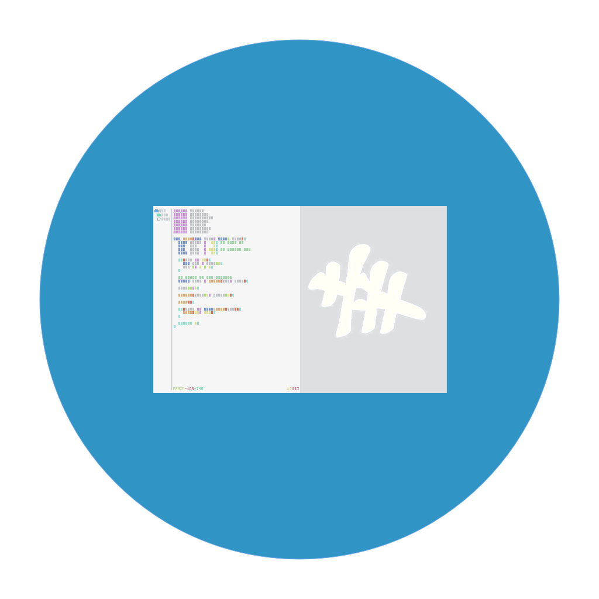
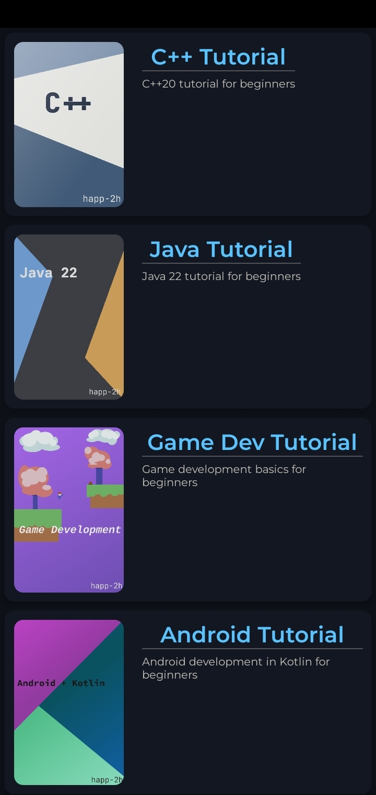
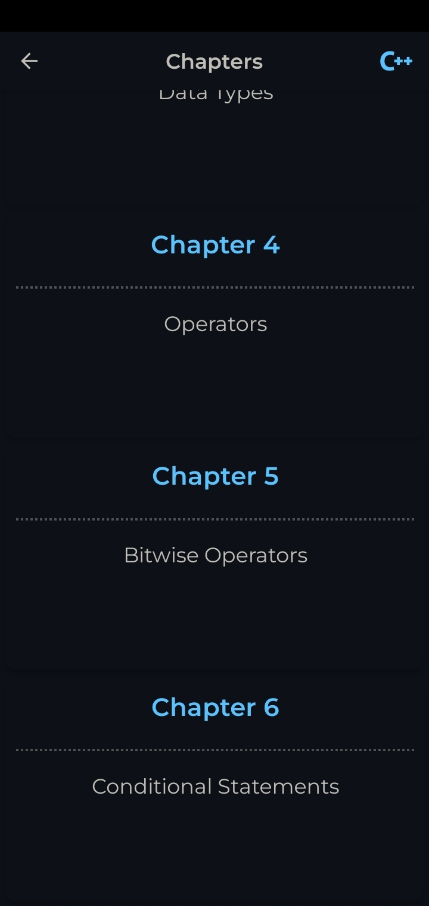
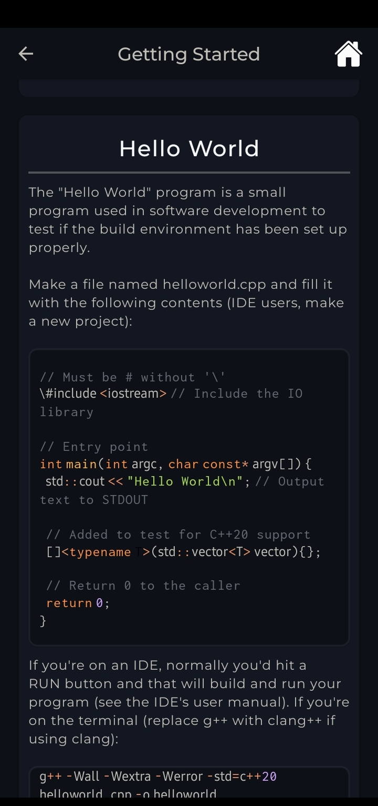

<a name="readme-top"></a>

<br />
<div align="center">
  <a>
    
  </a>

  <h3>H2H Tuts</h3>

  <p align="center">
    Write tutorials in a simple object format and render them for users.
  </p>
</div>

## About the Project

<p align="middle">
  
  
  
</p>

Group your tutorials in a blog/book-like format for your media subscribers.

### Tech Stack

- [React Native] - Brings the React programming paradigm to platforms like Android and iOS.
- [Expo] - Open-source platform for making universal native apps for Android, iOS, and the web with JavaScript and React.
- [Prism] - lightweight, extensible syntax highlighter.

## Getting Started

### Prerequisites

- Latest npm
```sh
npm install npm@latest -g
```

### Installation

> [!WARNING]
> Building requires an [EAS](https://docs.expo.dev/build/setup/) account

1. Clone the repo
   ```sh
   git clone
   ```
2. Install npm packages
   ```sh
   npm install
   ```
3. Use [EAS](https://docs.expo.dev/build/setup/) to build for your platform.

4. Install the final build depending on your platform.

_Alternatively, you can set up a local server via `npm start` and run it on an Android or iOS device through [Expo Go](https://expo.dev/go)._

### Writing Your Own Tutorial

See the Wiki for details on how you can write your own tutorials.

## Roadmap

- [ ] Ability to upload community content
- [ ] Ability to download community content

## License

Distributed under the MIT License. See `LICENSE.txt` for more information.


<p align="right">(<a href="#readme-top">Back to top</a>)</p>


<!-- Reference Links -->

[React Native]: <https://reactnative.dev/>
[Expo]: <https://expo.dev/>
[Prism]: <https://prismjs.com/>